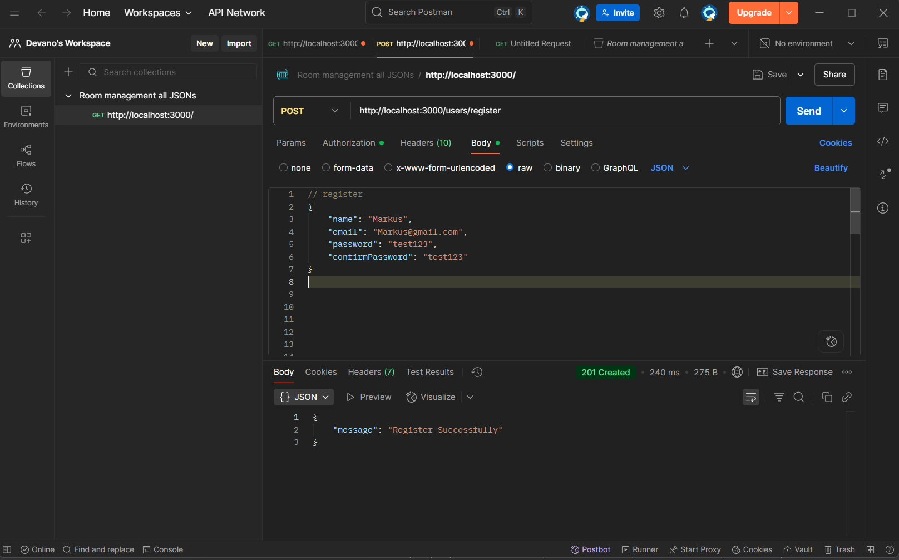
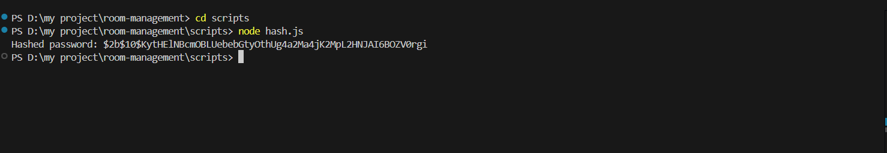
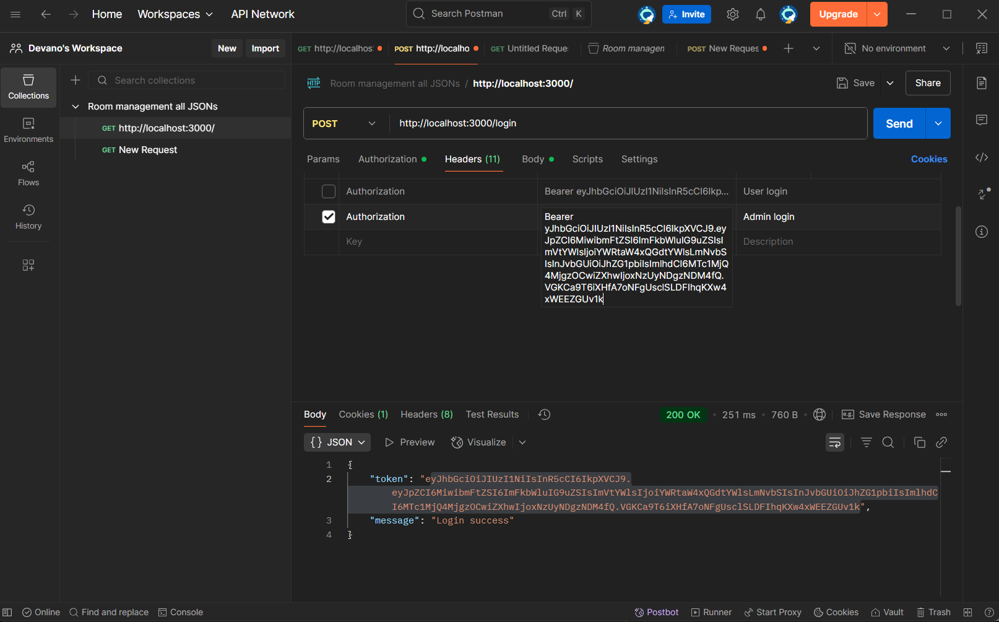
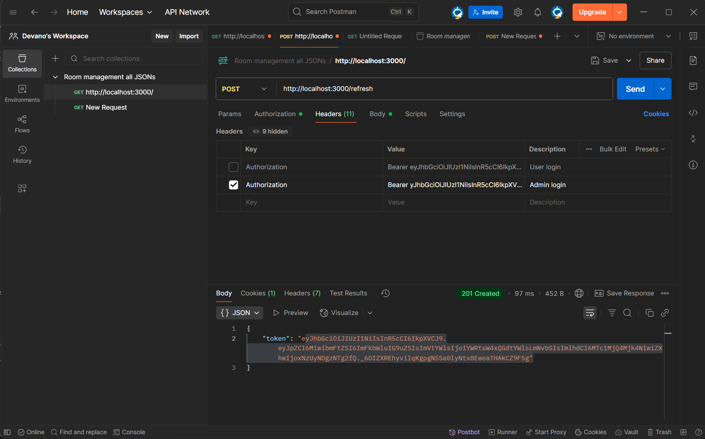

# Room Management REST API Guide

## Table of contents
- [Introductions](#introduction)
- [Key Roles](#key-roles)
- [Tech Stacks](#tech-stacks)
- [Installation Guide](#installation-guide)
- [Testing the API](#testing-the-api)
- [Version Update: V1.1.0](#new-version-v110--added-jwt-refresh-token)
- [Version Update: V1.1.1](#new-version-v111--update-readme)

## Introduction
Just like it's name, this API is designed to handle room management such as reservation functionalities for a multi-role system consisting of admins and users.

## Key Roles
### User Role
- Register & Login with JWT Authentication.
- View personal profile.
- Create, view, edit, and delete personal room reservations.

### Admin Role
- Manage all rooms: Create, View, Update, Delete.
- Cannot access or modify user reservations.

## Tech Stacks
- Backend: Node.js, express
- Database: PostgreSQL
- Security: Bcrypt for password hashing, and JWT for authentication
- Architecture: MVC(Model View Controller), without Views since it's a pure API

## Installation Guide
1. Clone the repo
```bash
git clone https://github.com/Agastya486/room-management-api.git
```

2. Inside the code editor, install all neccesary dependencies
```bash
npm i
```
this will install:
- Bcrypt: For password hashing
- dotenv: for storing sensitive datas and environment configuration
- express: Node.js' framework for building REST API, route handling, and middleware
- jsonwebtoken:  Create compact, self-contained tokens used for securely transmitting information between different applications or services
- pg: PostgreSQL's client for Node.js
- And other dependencies

3. Go to any Postgre's supported database management tool and create the tables
```sql
CREATE TYPE role AS ENUM ('user', 'admin')

CREATE TABLE users(
	id SERIAL PRIMARY KEY,
	name text,
	email text UNIQUE,
	password text,
	role role
)

CREATE TABLE rooms(
	id SERIAL PRIMARY KEY,
	name text,
	floor int,
	price numeric,
	capacity int
)

CREATE TABLE reservations(
	id SERIAL PRIMARY KEY,
	user_id INT,
	room_id INT,
	start_date TIMESTAMP,
	end_date TIMESTAMP,
	CONSTRAINT fk_user
		FOREIGN KEY(user_id)
			REFERENCES users(id),
	CONSTRAINT fk_room
		FOREIGN KEY(room_id)
			REFERENCES rooms(id)
)
```
4. Set the `.env` configuration
```.env
PGUSER = your_postgre_username
PGPASSWORD = your_postgre_password
PGHOST = localhost
PGDATABASE = your_database_name
PGPORT = 5432(This is the default)

SECRET_KEY = your_secret_key
```
4. Run the server
```bash
npm run start
```
if it's connected, it will returning
```bash
Connected on port (your_port)
```
5. Now you can test the API using any tools you want (I'm using Postman)

## Testing the API
1. Making new user account
<br>

<br>
In Database:
<br>


2. Making new admin account for the first time, we need to do it manually, by hashing the password using `hash.js` inside the `scripts` folder, and then manually insert it into database, please follow these steps:

	Using any IDE, open the `hash.js` and insert the password
	<br>
	
	<br>
	Run the `hash.js` and copy the hashed password
	<br>
	
	<br>
	Manually insert into database, you can run this query with your own desired values:
	```sql
	INSERT INTO users(name, email, password, role)
	VALUES('admin one', 'admin1@gmail.com', '$2b$10$KytHElNBcmOBLUebebGtyOthUg4a2Ma4jK2MpL2HNJAI6BOZV0rgi', 'admin')
	```
	<br>
	Inside Database:
	<br>
	
	<br>
	Now, if you want to insert another admin, you can do it exactly like registering user using Postman or similar, but with different endpoint, `admins/register`
	<br>
	<br>
	If we register a new admin as a user
	<br>
	

3. Login
<br>


4. Adding room (Admin only)
<br>

<br>
Inside Database:
<br>


5. Add 
<br>

<br>
<br>
If user try to input reservation while it's already reserved
<br>

<br>

### Note : Please use ISO 8601(YYYY-MM-DDThh:mm:ssZ) standard for the date

## New version V1.1.0 : Added JWT Refresh Token
### How to use it?
1. Log in like usual
2. After given a token, place it at header(if you are using postman)
<br>

<br>
3. If the token expired, you can go to `/refresh` endpoint and run it
<br>

<br>
After that, you can run the features like usual

## New version V1.1.1 : Update README